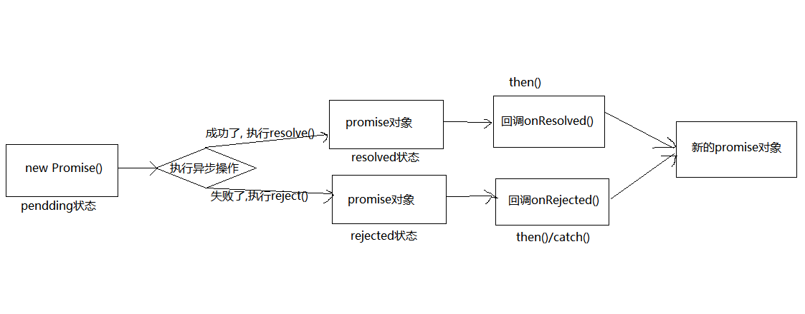
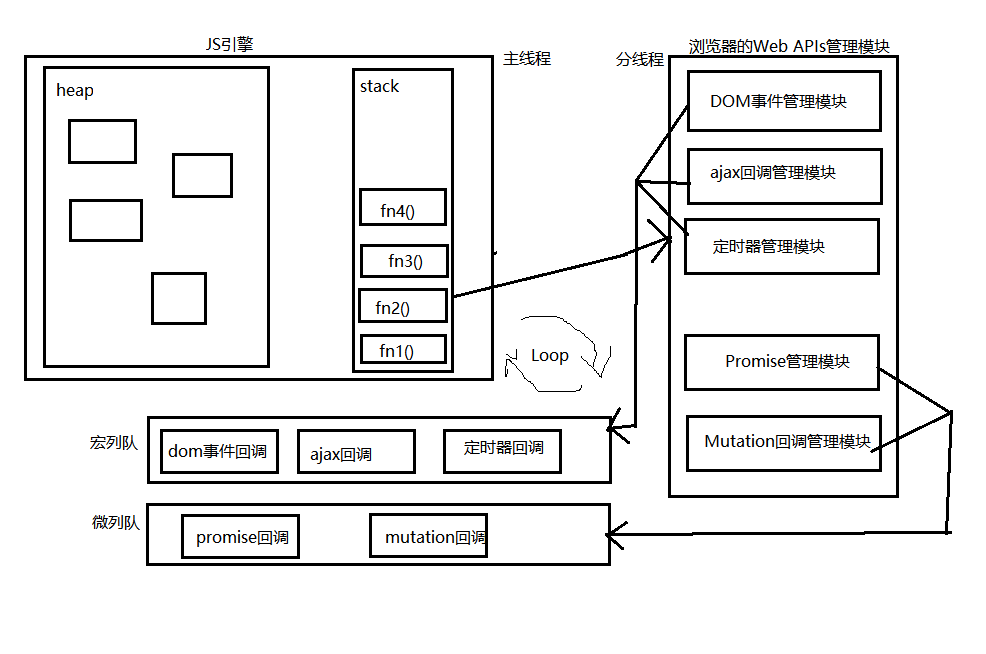

# Promise
## 1. 准备
### 1.1. 函数对象与实例对象
    1. 函数对象: 将函数作为对象使用时, 简称为函数对象
    2. 实例对象: new 函数产生的对象, 简称为对象

### 1.2. 回调函数的分类
    1. 同步回调: 
    理解: 立即执行, 完全执行完才结束, 不会放入回调队列中
    例如: 数组遍历相关的回调函数 / Promise 的 executor 函数
    2. 异步回调: 
    理解: 不会立即执行, 会放入回调队列中将来执行
    例如: 定时器回调 / ajax 回调 / Promise 的成功｜失败的回调

### 1.3. JS 中的 Error
    1. 错误的类型
    Error: 所有错误的父类型
    ReferenceError: 引用的变量不存在
    TypeError: 数据类型不正确
    RangeError: 数据值不在其所允许的范围内
    SyntaxError: 语法错误
    2. 错误处理
    捕获错误: try{ ... }catch(err){ ... }
    抛出错误: throw new Error('自定义的错误值')
    3. 错误对象
    message 属性: 错误相关信息
    stack 属性: 函数调用栈的记录信息

## 2. Promise 的理解和使用
### 2.1. Promise 介绍
    1. 什么是 Promise: 
    Promise 是 JS 中进行异步编程的解决方案。从语法上来说: Promise 是一个构造函数；从功能上来说: promise 对象用来封装一个异步操作并可以获取其结果
    
    2. Promise 的特点 
    (1) 对象的状态不受外界影响。Promise 对象代表一个异步操作，有三种状态：pending（进行中）、fulfilled（已成功）和 rejected（已失败）。只有异步操作的结果，可以决定当前是哪一种状态，任何其他操作都无法改变这个状态。这也是Promise这个名字的由来，它的英语意思就是“承诺”，表示其他手段无法改变。
    (2) 一旦状态改变，就不会再变，任何时候都可以得到这个结果。Promise 对象的状态改变，只有两种可能：从 pending 变为 fulfilled 和从 pending 变为 rejected。只要这两种情况发生，状态就凝固了，不会再变了，会一直保持这个结果，这时就称为 resolved（已定型）。如果改变已经发生了，你再对 Promise 对象添加回调函数，也会立即得到这个结果。这与事件（Event）完全不同，事件的特点是，如果你错过了它，再去监听，是得不到结果的。
   
    3. Promise 的基本流程
   
   
    4. Promise 优点
    (1) 指定回调函数的方式更加灵活: 可以在请求发出甚至结束后指定回调函数
    (2) 支持链式调用, 可以解决回调地狱问题

### 2.2. Promise的使用
    1. Promise 构造函数: Promise (excutor) {}
    executor 函数: 同步执行 (resolve, reject) => {}
    resolve 函数: 内部定义的成功时我们调用的函数 value => {}
    reject 函数: 内部定义的失败时我们调用的函数 reason => {}
    说明: executor 会在 Promise 内部立即同步回调，异步操作在执行器中执行

    2. Promise.resolve 方法: (value) => {}
    value: 成功的数据或 promise 对象
    说明: 返回一个成功/失败的 promise 对象

    3. Promise.reject 方法: (reason) => {}
    reason: 失败的原因
    说明: 返回一个失败的 promise 对象
```
function promiseFn(){
    let p = new Promise(function(resolve, reject){
        setTimeout(function(){
            var num = Math.ceil(Math.random()*20); //生成1-10的随机数
            console.log('随机数生成的值：',num)
            if(num<=10){
                resolve(num);
            }else{
                reject('数字太于10了即将执行失败回调');
            }
        }, 2000);
    })
    return p
}
promiseFn().then(
    function(data){
        console.log('resolved成功回调');
        console.log('成功回调接受的值：',data);
    },
    function(reason, data){
        console.log('rejected失败回调');
        console.log('失败执行回调抛出失败原因：',reason);
    }
);
```
> 以上代码：调用 promiseFn 方法执行，2 秒后获取到一个随机数，如果小于 10，我们算成功，调用 resolve 修改Promise 的状态为 fullfiled。否则我们认为是“失败”了，调用 reject 并传递一个参数，作为失败的原因。并将状态改成 rejected
> 运行 promiseFn 并且在 then 中传了两个参数，这两个参数分别是两个函数，then 方法可以接受两个参数，第一个对应resolve 的回调，第二个对应 reject 的回调。（也就是说 then 方法中接受两个回调，一个成功的回调函数，一个失败的回调函数，并且能在回调函数中拿到成功的数据和失败的原因），所以我们能够分别拿到成功和失败传过来的数据就有以上的运行结果

    4. Promise.prototype.then方法: (onResolved, onRejected) => {}
    onResolved 函数: 成功的回调函数 (value) => {}
    onRejected 函数: 失败的回调函数 (reason) => {}
    说明: 指定用于得到成功 value 的成功回调和用于得到失败 reason 的失败回调，返回一个新的 promise 对象

    5. Promise.prototype.catch方法: (onRejected) => {}
    onRejected 函数: 失败的回调函数 (reason) => {}
    说明: then() 的语法糖, 相当于: then(undefined,onRejected)
```
function promiseFn(){
    let p = new Promise(function(resolve, reject){
        setTimeout(function(){
            var num = Math.ceil(Math.random()*20); //生成1-10的随机数
            console.log('随机数生成的值：',num)
            if(num<=10){
                resolve(num);
            }else{
                reject('数字太于10了即将执行失败回调');
            }
        }, 2000);
    })
    return p
}
promiseFn().then(
    function(data){
        console.log('resolved成功回调');
        console.log('成功回调接受的值：',data);
        console.log(noData); //noData 未定义，此处报错会被 catch 捕获
    }
)
.catch(function(reason, data){
    console.log('catch到rejected失败回调');
    console.log('catch失败执行回调抛出失败原因：',reason);
});
```
>在resolve的回调中，我们console.log(noData);而noData这个变量是没有被定义的。如果我们不用Promise，代码运行到这里就直接在控制台报错了，不往下运行了。但是在这里，会得到上图的结果，也就是说进到catch方法里面去了，而且把错误原因传到了reason参数中。即便是有错误的代码也不会报错了

    6. Promise.all 方法: (promises) => {}
    promises: 包含 n 个 promise 的数组
    说明: 返回一个新的 promise, 只有所有的 promise 都成功才成功, 只要有一个失败了就直接失败
```
 function promiseFn1(){
    let p = new Promise(function(resolve, reject){
        setTimeout(function(){
            var num = Math.ceil(Math.random()*20); //生成1-10的随机数
            console.log('随机数生成的值：',num)
            if(num<=10){
                resolve(num);
            }else{
                reject('数字太于10了即将执行失败回调');
            }
        }, 2000);
    })
    return p
 }
 function promiseFn2(){
    let p = new Promise(function(resolve, reject){
        setTimeout(function(){
            var num = Math.ceil(Math.random()*20); //生成1-10的随机数
            console.log('随机数生成的值：',num)
            if(num<=10){
             resolve(num);
            }else{
                reject('数字太于10了即将执行失败回调');
            }
        }, 2000);
    })
    return p
 }
 function promiseFn3(){
    let p = new Promise(function(resolve, reject){
        setTimeout(function(){
            var num = Math.ceil(Math.random()*20); //生成1-10的随机数
            console.log('随机数生成的值：',num)
            if(num<=10){
                resolve(num);
            }
            else{
                reject('数字太于10了即将执行失败回调');
            }
        }, 2000);
     })
     return p
 }
 Promise
 .all([promiseFn3(), promiseFn2(), promiseFn1()])
 .then(function(results){
     console.log(results);
 });
```
>Promise.all来执行，all接收一个数组参数，这组参数为需要执行异步操作的所有方法，里面的值最终都算返回Promise对象。这样，三个异步操作的并行执行的，等到它们都执行完后才会进到then里面。那么，三个异步操作返回的数据哪里去了呢？都在then里面，all会把所有异步操作的结果放进一个数组中传给then，然后再执行then方法的成功回调将结果接收，结果：分别执行得到结果，all统一执行完三个函数并将值存在一个数组里面返回给then进行回调输出。这样以后就可以用all并行执行多个异步操作，并且在一个回调中处理所有的返回数据，比如你需要提前准备好所有数据才渲染页面的时候就可以使用all,执行多个异步操作将所有的数据处理好，再去渲染
    7. Promise.race方法: (promises) => {}
    promises: 包含 n 个 promise 的数组
    说明: 返回一个新的 promise, 第一个完成的 promise 的结果状态就是最终的结果状态
```
function promiseFn1(){
    let p = new Promise(function(resolve, reject){
       setTimeout(function(){
           var num = Math.ceil(Math.random()*20); //生成1-10的随机数
           console.log('2s随机数生成的值：',num)
           if(num<=10){
               resolve(num);
           }else{
               reject('2s数字太于10了即将执行失败回调');
           }
       }, 2000);
    })
    return p
}
function promiseFn2(){
    let p = new Promise(function(resolve, reject){
        setTimeout(function(){
            var num = Math.ceil(Math.random()*20); //生成1-10的随机数
            console.log('3s随机数生成的值：',num)
            if(num<=10){
                resolve(num);
            }else{
                reject('3s数字太于10了即将执行失败回调');
            }
        }, 3000);
    })
    return p
}
function promiseFn3(){
    let p = new Promise(function(resolve, reject){
        setTimeout(function(){
            var num = Math.ceil(Math.random()*20); //生成1-10的随机数
            console.log('4s随机数生成的值：',num)
            if(num<=10){
                resolve(num);
            }else{
                reject('4s数字太于10了即将执行失败回调');
            }
        }, 4000);
    })
    return p
}
Promise
.race([promiseFn3(), promiseFn2(), promiseFn1()])
.then(
    function(results){
        console.log('成功',results);
    },
    function(reason){
    console.log('失败',reason);
    }
)
```
>当 2s 后 promiseFn1 执行完成后就已经进入到了 then 里面回调，在 then 里面的回调开始执行时，promiseFn2()和 promiseFn3() 并没有停止，仍旧再执行。于是再过3秒后，输出了他们各自的值，但是将不会再进入race的任何回调。如图 2s 生成 10 进入 race 的成功回调后，其余函数继续执行，但是将不会再进入race的任何回调，2s 生成 16 进入了race 的失败回调，其余的继续执行，但是将不会再进入 race 的任何回调。race 的使用比如可以使用在一个请求在 10s 内请求成功的话就走 then 方法，如果 10s 内没有请求成功的话进入 reject 回调执行另一个操作。
```
function requestTableList(){
    var p = new Promise((resolve, reject) => {
        //去后台请求数据，这里可以是ajax,可以是axios,可以是fetch 
        resolve(res);
    });
    return p;
}
//延时函数，用于给请求计时 10s
function timeout(){
    var p = new Promise((resolve, reject) => {
        setTimeout(() => {
            reject('请求超时');
        }, 10000);
    });
    return p;
}
Promise.race([requestTableList(), timeout()]).then((data) =>{
    //进行成功回调处理
    console.log(data);
}).catch((err) => {
    // 失败回调处理
    console.log(err);
});
```

### 2.3. 几个重要问题
    1. 如何改变 promise 的状态
    (1)resolve(value): 如果当前是 pending 就会变为resolved
    (2)reject(reason): 如果当前是 pending 就会变为rejected
    (3)抛出异常: 如果当前是pending就会变为 rejected
    
    2. 一个 promise 指定多个成功/失败回调函数, 都会调用吗?
    当promise改变为对应状态时都会调用
    
    3. promise.then() 返回的新 promise 的结果状态由什么决定
    (1)简单表达: 由then() 指定的回调函数执行的结果决定
    (2)详细表达:
    ①如果抛出异常, 新 promise 变为 rejected, reason 为抛出的异常
    ②如果返回的是非 promise 的任意值, 新 promise 变为resolved, value 为返回的值
    ③如果返回的是另一个新 promise, 此 promise 的结果就会成为新 promise 的结果

    4. 改变 promise 状态和指定回调函数谁先谁后?
    (1)都有可能, 正常情况下是先指定回调再改变状态, 但也可以先改状态再指定回调
    (2)如何先改状态再指定回调?
    ①在执行器中直接调用 resolve()/reject()
    ②延迟更长时间才调用 then()
    (3)什么时候才能得到数据?
    ①如果先指定的回调, 那当状态发生改变时, 回调函数就会调用, 得到数据
    ②如果先改变的状态, 那当指定回调时, 回调函数就会调用, 得到数据

    5. promise 如何串连多个操作任务
    (1)promise 的 then() 返回一个新的 promise, 可以开成 then() 的链式调用
    (2)通过 then 的链式调用串连多个同步/异步任务
    
    6. promise 异常传透
    (1)当使用 promise 的 then 链式调用时, 可以在最后指定失败的回调
    (2)前面任何操作出了异常, 都会传到最后失败的回调中处理
    
    7. 中断 promise 链
    (1)当使用 promise 的 then 链式调用时, 在中间中断, 不再调用后面的回调函数
    (2)办法: 在回调函数中返回一个 pending 状态的 promise 对象 return new Promise(()=>{})

## 3. 自定义 Promise
    1. 定义整体结构
    2. Promise 构造函数的实现
    3. promise.then()/catch() 的实现
    4. Promise.resolve()/reject() 的实现
    5. Promise.all/race() 的实现
    6. Promise.resolveDelay()/rejectDelay() 的实现
    7. ES6 class 版本

## 4. async 与 await
    1. async 函数
        函数的返回值为 promise 对象
        promise对象的结果由 async 函数执行的返回值决定
   
    2. await 表达式
        await右侧的表达式一般为 promise 对象, 但也可以是其它的值
        如果表达式是 promise 对象, await 返回的是 promise 成功的值
        如果表达式是其它值, 直接将此值作为 await 的返回值
    
    3. 注意:
        await 必须写在 async 函数中, 但 async 函数中可以没有 await
        如果 await 的 promise 失败了, 就会抛出异常, 需要通过 try...catch 来捕获处理

## 5. JS 异步之宏队列与微队列


    1. 宏列队: 用来保存待执行的宏任务(回调), 比如: 定时器回调/DOM 事件回调/ajax 回调
    
    2. 微列队: 用来保存待执行的微任务(回调), 比如: promise 的回调/MutationObserver 的回调
    
    3. JS 执行时会区别这 2 个队列
    JS引擎首先必须先执行所有的初始化同步任务代码
    每次准备取出第一个宏任务执行前, 都要将所有的微任务一个一个取出来执行

## 6. Promise 相关面试题
